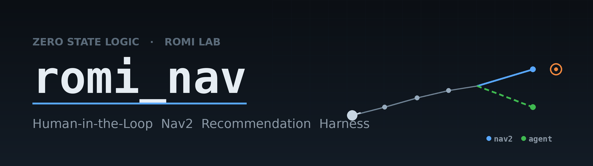
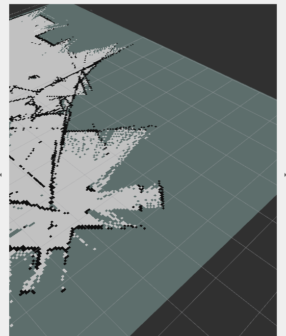
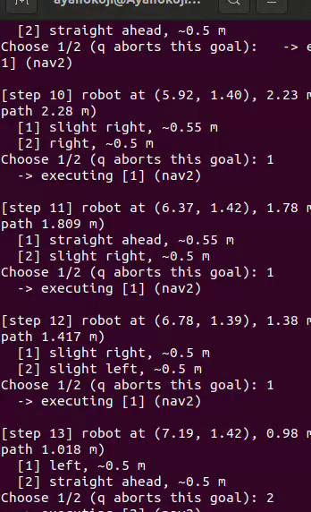

<!-- ============================================================= -->
<!--  BANNER: save a project banner as media/banner.png            -->
<!--  (a clean RViz map shot or the robot render works well)       -->
<!-- ============================================================= -->


# romi_nav — Human-in-the-Loop Nav2 Recommendation Harness


> A ROS 2 harness for collecting **imitation-learning** data on a mobile robot.
> At each short leg the robot offers **two candidate moves** — one from the Nav2
> planner, one from an agent — a **human picks one**, and only that leg runs.
> Every decision is logged as training data.

<sub>Built under <b>Zero State Logic</b> · for ROMI Lab · simulation working end-to-end (Webots + TurtleBot3), physical robot (RPi 4B + RPLIDAR A1, 4-wheel differential drive) in progress.</sub>

---

## 🤖 Overview

**What it is:** a decision-logging harness. It asks Nav2's `planner_server` for a
candidate path (a pure `ComputePathToPose` query — nothing moves), gets a second
candidate from a pluggable agent, prints both in plain robot-relative language
(*"slight left, ~0.5 m"*), and executes **only the human's choice** by sending that
one short segment straight to `controller_server`'s `FollowPath` action. It
deliberately bypasses `bt_navigator`/`NavigateToPose` so autonomous replanning and
recovery spins never contaminate a labeled leg. Every decision is appended as one
JSON line to `~/romi_ws/data/decisions_<timestamp>.jsonl`.

**What it isn't:** an autonomous navigator. The agent is a **swap-point** — the
included `AgentPolicy` is a clearly-marked heuristic stub (`# TODO: replace with
trained IL/RL model`); a trained model drops in behind the same `propose(obs)`
contract with no changes to the harness loop.

---

## 🧠 How it works

```
        ┌──────────────┐  candidate A (planner path slice)
 goal ─▶│ planner_server│─────────────────────────────────┐
        │ (path query)  │                                  ▼
        └──────────────┘                        ┌────────────────────┐  [1]/[2]
                                                 │ recommendation node │◀─ human
        ┌──────────────┐  candidate B            │  (RecommendationHarness) │
        │  AgentPolicy │────────────────────────▶└────────────────────┘
        │  (stub, in-repo)│                                 │ chosen leg only
        └──────────────┘                                    ▼
                                        validate_path() ▶ controller_server / FollowPath
                                                            │
                                                            ▼
                                              decision ▶ data/*.jsonl
```

1. Human clicks a goal in RViz (published to **`/harness/goal`**, *not* `/goal_pose`).
2. The node queries Nav2 for a planner candidate and the agent for a second one.
3. Both are printed as short, robot-relative options, **in randomized order** (so
   position bias doesn't poison the labels — the true order is logged). Nothing moves.
4. Human presses `1` or `2`; the chosen ~0.5 m leg executes via `FollowPath`.
5. The decision (pose, downsampled scan, both candidates, choice, outcome) is logged.

**Design details worth knowing (all in the code):**
- **`validate_path()`** gates every chosen leg against the global costmap — the
  agent's synthesized straight-line leg can cut through a wall, so a blocked leg is
  clipped or refused, and logged once with its true outcome.
- **`recover()`** frees a wedged robot with a scan+costmap-fused, **reverse-first**
  escape (the LDS is blind below ~0.12 m; the costmap still sees the contact).
  Recovery is housekeeping — it runs *after* the stuck leg is logged and is **never**
  itself logged as a decision.
- **Direct `FollowPath`** avoids a Humble-era `bt_navigator` action-client race that
  instantly aborts fast micro-goals.

---

## 📦 Repository layout

```
romi_nav/                      # ROS 2 package (ament_python)
  romi_nav/
    recommendation_node.py       # the harness + inline AgentPolicy stub
    __init__.py
  launch/
    bringup.launch.py            # Webots + TurtleBot3 driver (publishes /clock)
    slam.launch.py               # slam_toolbox online-async mapping
    nav.launch.py                # AMCL + Nav2 on the saved static map
  config/
    nav2_params.yaml             # planner / controller / costmap params
  worlds/
    romi_small.wbt               # ROMI Lab custom Webots world
  resource/romi_nav
  setup.py
  package.xml
maps/
  romi_map.yaml / .pgm           # raw slam_toolbox output
  romi_map_clean.yaml / .pgm     # cleaned map used for navigation (canonical)
media/                           # screenshots for this README
README.md
LICENSE                          # MIT
.gitignore
```

**Never committed (by design):** trained models, `data/*.jsonl`, build artifacts.

> Note for cloners: the launch files reference maps under `~/romi_ws/maps/`. After
> cloning, copy `maps/*` there, or pass `map:=<repo>/maps/romi_map_clean.yaml`.

---

## ⚙️ Setup & build

```bash
# Ubuntu 22.04 + ROS 2 Humble + Nav2 + webots_ros2 + slam_toolbox
cd ~/romi_ws
colcon build --packages-select romi_nav
```

Source both in **every** terminal below:

```bash
source /opt/ros/humble/setup.bash
source ~/romi_ws/install/setup.bash
```

---

## 🗺️ Phase 1 — Map the room (do this once)

```bash
# T1 — simulation + robot
ros2 launch romi_nav bringup.launch.py

# T2 — SLAM
ros2 launch romi_nav slam.launch.py

# T3 — drive the robot around until the whole room is mapped (watch /map in RViz)
ros2 run teleop_twist_keyboard teleop_twist_keyboard

# T4 — save the map
ros2 run nav2_map_server map_saver_cli -f ~/romi_ws/maps/romi_map
```

This writes `romi_map.pgm` + `romi_map.yaml`. Optionally clean the `.pgm` (e.g. in
GIMP — erase stray specks, close gaps) and save it as `romi_map_clean.pgm` /
`romi_map_clean.yaml`; that cleaned map is what the harness navigates on.

---

## 🚀 Phase 2 — Run the harness (on the saved map)

Four terminals, **in this order** (Nav2 needs the sim clock first, or lifecycle
configuration times out):

```bash
# T1 — simulation + robot
ros2 launch romi_nav bringup.launch.py

# T2 — Nav2 on the saved map
ros2 launch romi_nav nav.launch.py map:=$HOME/romi_ws/maps/romi_map_clean.yaml

# T3 — RViz (localize with "2D Pose Estimate" if AMCL isn't already)
rviz2

# T4 — the harness
ros2 run romi_nav recommendation_node
```

### ⚠️ The one thing people get wrong

The harness listens on **`/harness/goal`**, not `/goal_pose`. In RViz:
`Panels → Tool Properties → 2D Goal Pose → Topic: /harness/goal`. On `/goal_pose`,
Nav2 autopilots the robot and the harness never gets to offer a choice.

**Success looks like:** you click a goal and the robot does **NOT** move. T4 prints
two options and waits. You press `1` or `2`, and *then* it drives one short leg.
That is the moment training data is being generated.

---

## 🧾 Data format

Each decision is one JSON object per line in `~/romi_ws/data/decisions_<ts>.jsonl`:

| field | meaning |
|---|---|
| `t_wall`, `t_sim` | wall-clock and sim-clock timestamps |
| `step`, `goal_seq` | leg index within the episode, and which goal |
| `final_goal`, `pose` | episode goal and robot pose (`x`, `y`, `yaw`) |
| `scan` | LaserScan downsampled to `scan_beams` (default 72) ranges |
| `nav2_candidate` | planner candidate + `path_length` |
| `agent_candidate` | agent's proposed micro-goal |
| `chosen` | `"nav2"` or `"agent"` |
| `display_order` | true on-screen order (bias audit) |
| `outcome` | `reached`, `duration_s`, optional `note` (clipped / stuck / vetoed) |

Recovery/backup maneuvers are **never** logged as decisions. `data/` is git-ignored.

---

## 🧩 Agent (swap-point)

`recommendation_node.py` defines `AgentPolicy` inline and calls
`.propose(obs)` for the second candidate, where
`obs = {'pose', 'final_goal', 'scan'}`.

- **Included stub:** heads roughly toward the goal but perturbs the heading by a
  random 20–45°, resampling if the LiDAR shows an obstacle within the step — plausible,
  clearly different from Nav2, never a wall-crash.
- **Trained model:** replace the body of `propose()`; the contract (and a future
  `'image'` key for a visual policy) keeps the harness loop unchanged.

---

## 🛠️ Troubleshooting

| Symptom | Cause / fix |
|---|---|
| Every leg aborts; robot creeps then stops | Goal-checker rejecting very short (~0.5 m) goals — read `controller_server`/`planner_server` output; adjust tolerances in `nav2_params.yaml` (goal checker: xy 0.10 m / yaw 0.5 rad). |
| Nav2 never activates (lifecycle managers abort at configure) | Confirm the `map:=` file exists (`ls ~/romi_ws/maps/`), and that T1 (publishing `/clock`) is up **before** Nav2. |
| Chosen leg would drive through a wall | `validate_path()` clips/refuses it against the global costmap; ensure `always_send_full_costmap` is set and the global costmap topic is latched. |
| Robot wedged, every goal fails | The node's own recovery reverses out and clears costmaps; if it can't, teleop the robot clear. |
| `/tmp/...world` in the Webots title bar | The launch generated a scratch world — make sure it loads `worlds/romi_small.wbt`. |

---

## 🔩 Hardware (physical robot)

- **Drive:** 4-wheel **skid-steer / differential** — Nav2 treats it as a standard
  diff-drive base, so the sim config ports over.
- **Compute split:** the **Pi** runs only drivers (RPLIDAR A1 + the ESP32-S3 motor
  bridge); the **laptop** runs Nav2, SLAM, RViz, the harness, and the agent. One ROS 2
  graph over WiFi — `/scan`, `/odom`, `/cmd_vel` are identical to the sim, so the
  harness doesn't change.
- **Motor map, wiring, BOM, chassis DXFs:** `TODO — add when finalized.`

---

## 📸 System Demonstration

> Save the images below into `media/` before pushing, or GitHub shows broken-image
> icons. Names are referenced exactly — match them.

**Mapped room (RViz):**


**Harness presenting two candidates:**


**Robot executing the chosen leg:**


### 🎥 Video Demo
`TODO: add a short screen-recording link of a full choose → drive → log cycle`

---

## 📄 License

Released under the **Apache License 2.0** (see `LICENSE`) — chosen over MIT for its
explicit patent grant, appropriate for research code.

---

## 📬 Contact

**Zero State Logic** — Faysal Ali Shah
- Portfolio: `TODO`
- LinkedIn: `TODO`
- Email: see `package.xml` maintainer field
